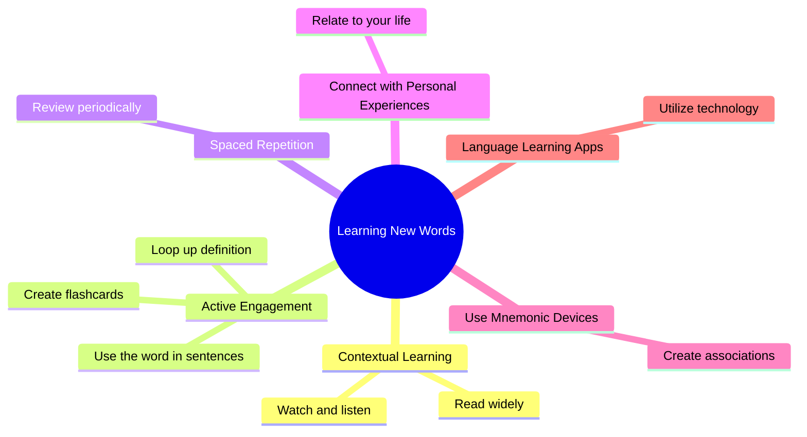

# English
## Learning New Words

```mermaid
mindmap
	root((Learning New Words))
		Contextual Learning
			Read widely
			Watch and listen
		Active Engagement
			Loop up definition
			Use the word in sentences
			Create flashcards
		Spaced Repetition
			Review periodically
		Connect with Personal Experiences
			Relate to your life
		Use Mnemonic Devices
			Create associations
		Language Learning Apps
			Utilize technology
		
```