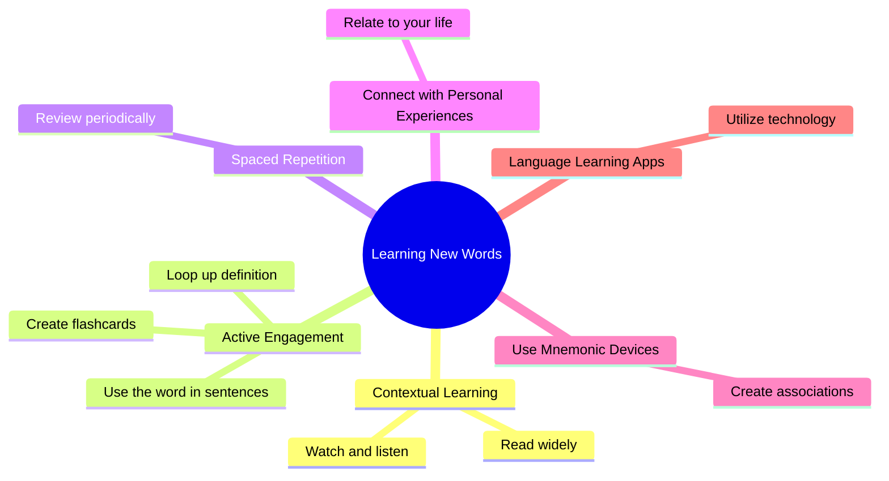

# English
## Learning New Words

### AI Template

I'm working on expanding my vocabulary and want to deeply understand the word "consistent." I learn best through context and personal connection, so I'd appreciate your help with the following:

1. **Contextual Examples:** Provide 2-3 examples of how the word is used in different situations. Ideally, these examples should be relatable to everyday life, such as: work, school, personal habits, and relationships.
2. **Personal Reflection Prompt:** Instead of a direct definition, could you please offer a prompt that encourages me connect the word to my own experiences? 
3. **Pronunciation:** Please provide the pronunciation in American English. Using the International Phonetic Alphabet (IPA) or a link to an audio pronunciation would be very helpful.
4. **Antonyms/Synonyms in Context:** To further clarify the meaning, please provide 2-3 synonym and 2-3 antonyms for the word, each used in a sentence that provides context similar to the examples in point 1. This helps me see the nuances in meaning.
5. **Different Forms of the Word:** Please list other forms of the word, such as adverbs, nouns, etc., and provide a brief example of each in a sentence.
6. **Quote (Optional):** If you have a relevant quote that uses the word meaningfully, I'd be interested. However, my priority is the contextual examples and personal reflection, synonyms/antonyms, and different word forms.
